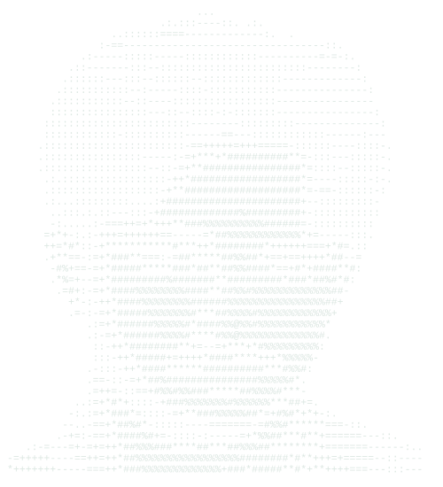

  

  

  

  

<h2 align="center">◉ <i>About Me</i></h2>

  Hello! My name is <strong>Mohammed Nihal S</strong>, and I am a
  <strong>Robotics and Artificial Intelligence Engineering student</strong>.
  I am passionate about exploring new technologies, building intelligent
  applications, and solving real-world problems through programming and AI.
  Currently, I am strengthening my skills in
  <strong>Python, Machine Learning, Deep Learning, Generative AI, LLMs, RAG,
  FastAPI, Flask, NLP, Computer Vision, and backend development</strong>,
  with a focus on creating practical, scalable, and AI-powered software while
  continuously growing as a developer.

 

## 🌐 Socials:
   

# 💻 Tech Stack:
                    
# 📊 GitHub Stats:
 
 

---

<!-- Proudly created with GPRM ( https://gprm.itsvg.in ) -->
