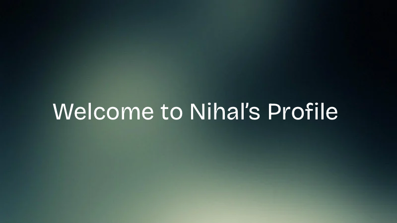

  

# 💫 About Me:
### 👨‍💻 About Me  I'm a Robotics & Artificial Intelligence Engineering student passionate about building intelligent software systems. I enjoy working with AI/ML, LLMs, backend development, and automation, and I'm constantly exploring new technologies by building practical projects.  🔭 I’m currently working on AI/ML projects, LLM-powered applications, RAG systems, and intelligent automation.  👯 I’m looking to collaborate on AI/ML, Generative AI, LLM, RAG, NLP, Computer Vision, and Python-based open-source projects.  🤝 I’m looking for help with building scalable AI systems, advanced LLM applications, cloud deployment, and production-level machine learning systems.  🌱 I’m currently learning advanced Machine Learning, Deep Learning, Generative AI, LLMs, RAG, backend development, and cloud technologies.  💬 Ask me about Python, AI/ML, LLMs, RAG, FastAPI, Flask, REST APIs, NLP, Computer Vision, MySQL, MongoDB, and AI automation.  ⚡ Fun fact: I love turning AI ideas into practical applications — from personal AI assistants to systems that can understand documents and automate everyday tasks.

## 🌐 Socials:
   

# 💻 Tech Stack:
                    
# 📊 GitHub Stats:
 
 

---

<!-- Proudly created with GPRM ( https://gprm.itsvg.in ) -->
